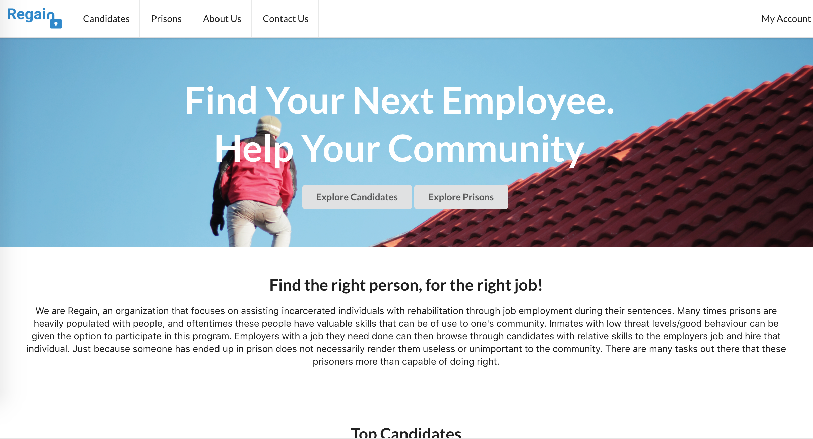
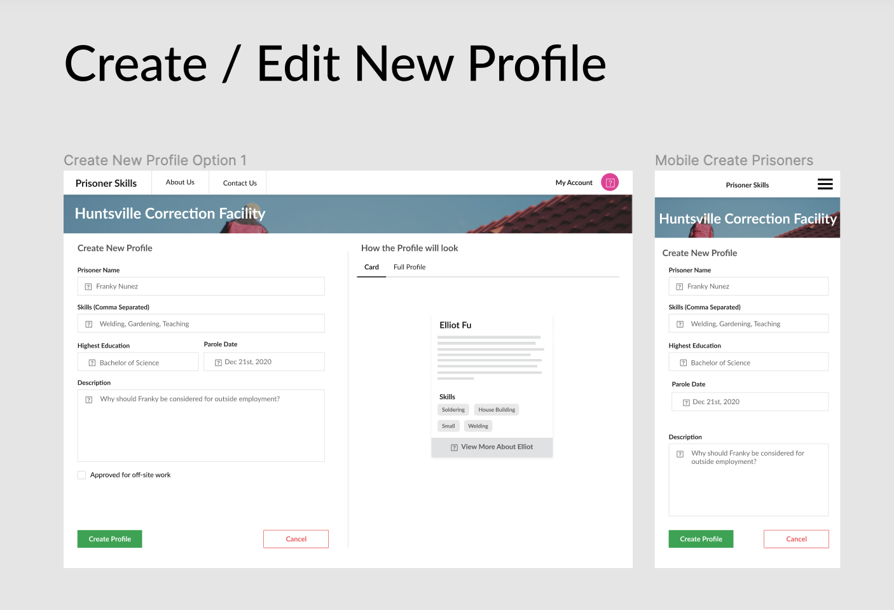

# Regain

[A Lambda School Project](https://lambdaschool.com)

Live Project: [Regain: Prisoner Skills](https://regain.now.sh)



## Motivation

This project was inspired by the need to help inmates find work while they are still in prison despite their incarceration. Most inmates have tangible skills that go to waste while they are incarcerated. Regain's mission is to help those inmates regain their passion and use their skills by connecting employers with prisons and their candidates.

## Highlights

Here are some of the highlights from this build week

1. Designed in 1 day.
2. Built in 4 days.
3. Utilized Semantic UI for almost all components
4. Generalized Context API HOC created for passing data to Formik forms (no redux nonsense)

## Challenge

Build an MVP project in 4 days based on the following premise:

```
Prisoner skills

PITCH
Pitch: This app allows prison management to broadcast the skill of inmates to make better use of their time using their skills to make a wage and becoming more employable after prison.

MVP
This app contains two user types. A prison admin (who has the ability to log in) and a single user (no need to log in so no need for user data to be persisted on this user type) who can view posted profiles by prison.
Home Page (For potential employer) - No need to log in. Contains a list of prisons who have posted prisoner profiles. Each prison is laid out in a grid format, with the name of the prison, number of people available to work (total number of entries a given prison admin has submitted), and the physical address/location of the prison. Clicking on a prison takes you to the prisoner profile page.
Prisoner Profile page: Accessed from the home page, non-logged in users can view the list of profiles created by the prison they clicked on.
Single Profile Page: Users can click on a single post to read more of the description.
Home Page (For a prison) - If no profile is created, be sure to allow a prison to create a profile and add it to the list of prisons on the general home page. After an admin logs in, they are directed to a page where they can see the people’s profiles they’ve created in a list view, and have options to create new one.
Create profile page: An admin can create a prisoner’s profile. Should include name, availability (permissions to work in prison only or able to have work leave), and list of skills and/or previous work experience. The profile can be edited and deleted after creation.

Navigation - Navigation is present on all pages, Users should know what page is active by clicking on a nav link and activating their tab.

STRETCH
A single user could search for prisons by entering their zip code and defining a search radius. An admin can upload a pdf of a prisoner’s resume.
```

## Responsibilities

There were 0 design documents, so everything was designed from scratch.

1. Create low fidelity wireframes to get initial ideas off the ground.
2. Create a scope for the project.
3. Build everything from scratch.
4. Do it all in 4 days.

## How To Run

If you're looking to clone this project and run it yourself follow the below steps:

1. Fork and clone project
2. Run `yarn` at `client` folder to download dependencies
3. Run `yarn start` at `client`

## Designs

All design files can be found here:

https://www.figma.com/file/NlRcCJQ0HqY4ZmORi3jEJE/All?node-id=0%3A1

Example:


## Team

This team was fun to work with. Tatiana in particular made the front end work a breeze by providing excellent documentation for the front end calls.

1. Backend: [Tatiana](https://github.com/tfaramar)
2. Frontend: [Luis](https://github.com/LuisOcasio)
3. Frontend: [Femi](https://github.com/Oluwa-Femi)
4. Frontend: [Lucas](https://github.com/lucasbaze)
5. Landing Page: [Eric](https://github.com/itsericfig)
6. Landing Page: [David](https://github.com/ikeman32)
7. Team Lead: [Brett](https://github.com/brettmadrid)

## Future Work

Given the time constraint there are several areas that I wish we could have spent more time on:

1. Location based identification
2. Notifications for the prisons
3. Better mobile styling
4. Further testing for components
5. Higher fidelity search capability
6. More robust card components

### Technology

See package.json
